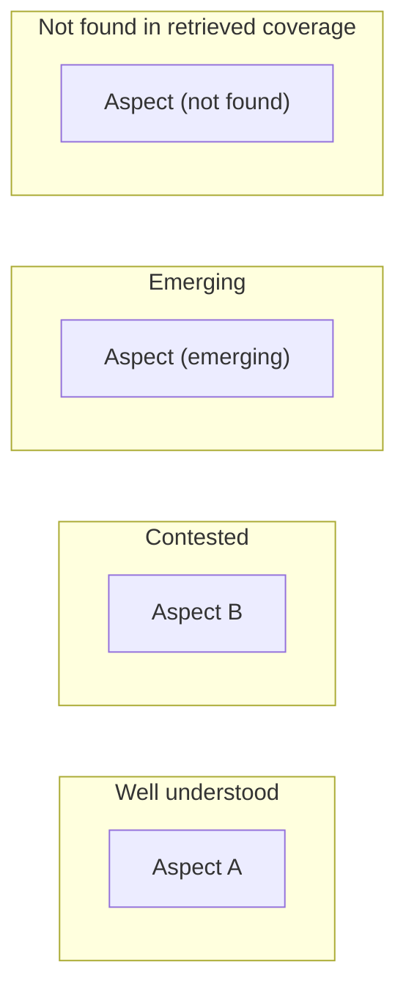

# Dashboard Template — `landscape-dashboard.md`

Render sections in the **fixed order** below. All claims inline-link to their anchors (UC Library
Search or DOI URLs). Write in **plain language** a scholar can follow without prior tool knowledge:
define terms on first use, state each decision with its rationale, and be transparent about
strengths, weaknesses, and limits. The example blocks at the end are a **neutral schematic layout
example — not real content**; never put real-topic content in the template itself.

## Fixed section order

1. **Header** — topic, run id/date, skill versions, link to `search-strategies.md`.
2. **How to read this map** (start here) — 2–3 plain sentences: what a landscape map is; what
   zone/evidence states mean; that "not found in retrieved coverage" is not proof of absence.
3. **Landscape at a glance** — `quadrant` module.
4. **Aspect & coverage matrix** — `aspect_coverage` module. Include `dimensions` rows (geography,
   population, context, methodology, time, discipline) plus emergent aspects; mark addressed vs. untouched.
5. **Geography & population map** — `geo_pop` module.
6. **Chronology** — `chronology` module; mark the peak period.
7. **Methodology mix** — `methods` module.
8. **Takeaway cards** — `takeaways` module; blockquote per takeaway ending with anchor links and
   `(confidence: ...)`.
9. **Gaps & next queries** — one block per gap: the qualified statement, `gap_type`, and a
   ready-to-run suggested query URL.
10. **Why these views** — the module selection lines (see `module-registry.md`).
11. **Decisions, strengths & weaknesses** — required. Cover at minimum the substrate choice
    (metadata/abstract-level), two-tier fidelity, gap labeling, screening cap, and module-selection
    threshold — for each, state the strength and the weakness/limit honestly.
12. **Glossary** — starter list (see below), plus every term used that the intended reader might
    ask about. Define terms in plain language.
13. **Limitations** — always included: screening caps; gap statements relative to retrieved
    coverage; Tier-2 claims only from records actually read; geography/population tags are
    abstract-derived proxies.

**Per-view guidance:** for each of sections 3–9 include one line each for *What it shows*,
*Decisions made*, and *Limits* — one line is enough; omit the section entirely if the module was
not selected (its "why omitted" line already appears in section 10).

**Glossary starter list:** landscape map, evidence state, confidence, provenance/anchor, Tier 1 /
Tier 2, aspect (component / sub_question / framework / lens), dimension, coverage, sufficiency,
gap, takeaway.

---

## Neutral schematic example (layout only — replace with live data)

The following blocks show the shape of sections 2, 3, 4, 8, and 9 with placeholder labels. Copy
the *structure*, never the content.

### How to read this map

Zones reflect the evidence states across the records we screened. "Not found" means our retrieved
coverage did not include it — not that no scholarship exists.

### Landscape at a glance (schematic)

### Aspect & coverage matrix (schematic)

| Aspect | Kind | Evidence state | Records | Confidence |
|---|---|---|---|---|
| Aspect A | component | well understood | [rec_001], [rec_002] | high |
| Aspect B | component | contested | [rec_003], [rec_004] | medium |
| Aspect C | sub_question | not found in retrieved coverage | — | low |

### Takeaway cards (schematic)

> [Takeaway statement — only when strongly supported, with anchors and confidence.]
> Anchors: [rec_001](https://doi.org/...) · [rec_002](https://doi.org/...) · (confidence: high)

### Gaps & next queries (schematic)

- **Not found in retrieved coverage:** [gap statement]. Test: [copy-paste query] — [run query](https://search-library.ucsd.edu/discovery/search?query=...)
